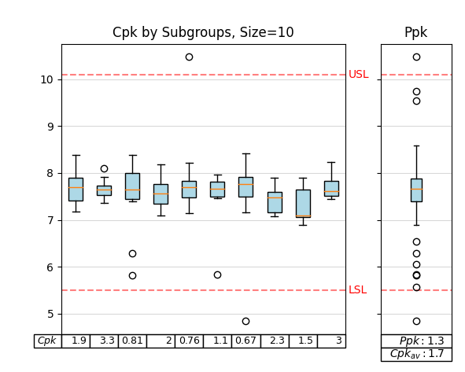
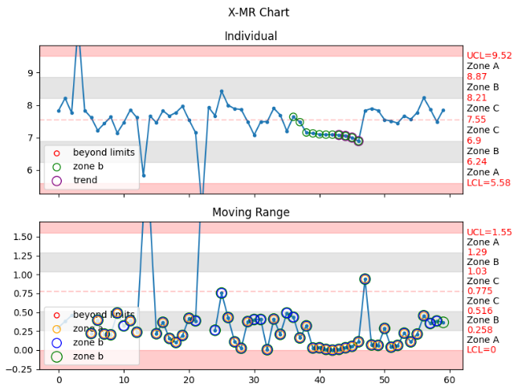
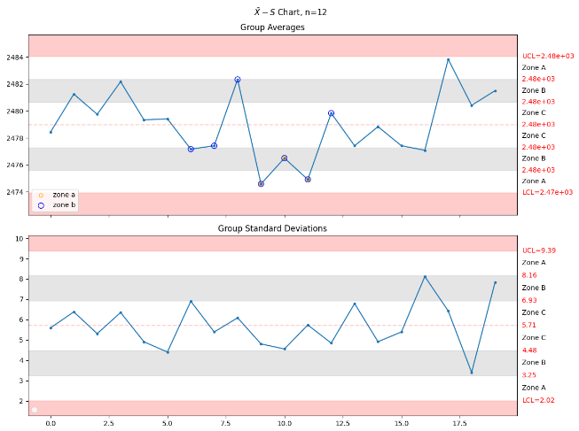

# Purpose

To provide analysis tools and metrics useful in manufacturing environments.

Go to the [documentation](https://manufacturing.readthedocs.io/en/latest/).

# Project Maturity

Project is currently undergoing frequent updates for documentation and to add
functionality and update documentation!!  Screenshots and features that you see
on here may be out of date, but are in progress.  It is expected that 
v1.2.X series of releases will have complete documentation and be up to 
industry standards.

# Installation

To install from `pypi`:

    pip install manufacturing

To install from source download and install using poetry:

    poetry install

# Usage

## Cpk Visualization

The most useful feature of the `manufacturing` package is the visualization of Cpk.
As hinted previously, the `ppk_plot()` function is the primary method for display of
Cpk visual information.  First, get your data into a `list`, `numpy.array`, or 
`pandas.Series`; then supply that data, along with the `lower_control_limit` and 
`upper_control_limit` into the `ppk_plot()` function.

    manufacturing.ppk_plot(data, lower_specification_limit=-2, upper_specification_limit=2)
    

In this example, it appears that the manufacturing processes are not up to the task of 
making consistent product within the specified limits.

## Zone Control Visualization

Another useful feature is the zone control visualization.

    manufacturing.control_chart(data)

There are X-MR charts, Xbar-R charts, and Xbar-S charts available as well.  If you call the 
`control_chart()` function, the appropriate sample size will be selected and data grouped as
the dataset requires.  However, if you wish to call a specific type of control chart, use

 - `x_mr_chart`
 - `xbar_r_chart`
 - `xbar_s_chart`

# Contributions

Contributions are welcome!  

## RoadMap

Items marked out were added most recently.

 - ...
 - ~~Add use github actions for deployment~~
 - ~~Transition to `poetry` for releases~~
 - ~~Add `I-MR Chart` (see `examples/imr_chart.py`)~~
 - ~~Add `Xbar-R Chart` (subgroups between 2 and 10)~~
 - ~~Add `Xbar-S Chart` (subgroups of 11 or more)~~
 - Update documentation to reflect recent API changes
 - Add automated testing

# Gallery

